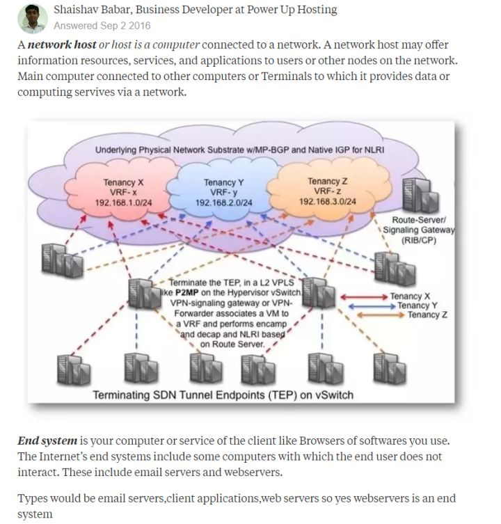

# 综述
公共因特网作为讨论计算机网络及其协议的主要载体。
关于什么是因特网，从两个方面去回答这个问题：
  - 1：从因特网的基本硬件和软件组件，也就是我们能够描述出因特网的具体构成
  - 2：根据为分布式应用提供服务的联网基础设施描述
## 1：从具体构成方面去描述
当初刚上高中的时候，才拥有第一部二手手机，当时也没无线网，也不懂怎么操作，瞎弄情况下，终于用上了5元30兆的数据流量。随着时代发展，自己手里的设备相比之前也好了很多，也增加了很多。包括电脑，手机等等。在因特网术语中来说，这些设备称之为 **主机**(host)或者 **端系统**(end system)。

  

端系统通过 **通信链路**(communication link)和 **分组交换机**(packet switch)连接到一起。
  - 关于通信链路这里稍微提一下：
    - 1：它们由不同类型的物理媒体组成，这些物理媒体包括同轴电缆、铜线和无线电频谱。
    - 2：不同链路能以不同的速率传输数据
    - 3：链路的 **传输速率** 以 比特/秒 度量(bit/s,或bps)
  - 先提一个 **分组**(packet)的概念：
    - 当一个端系统向另一个端系统发送数据的时候，发送端将数据分段，并且为每段加上首部字节，由此而形成的信息包用计算机网络的术语称之为分组。这些分组通过网络发送到目的端系统，在那里被装配成初始数据
  - 再来看分组交换机：
    - 分组交换机从它的一条入通信链路接受到达的分组，并从它的一条出通信链路转发该分组。
    - 常见的分组交换机类型：**路由器**(router)和 **链路层交换机**(link-layer switch)；路由器常用语```网络核心```中，链路层交换机常用语```接入网```中

从发送端系统到接收端系统，一个分组所经历的一系列通信链路和分组交换机成为通过该网络的 **路径**(route或path)。

*举个栗子*：
  以A寄快递给B为例：从A到B快递所走的路，有空中、高速、公路等。在A处，快递员要写快递单，指示信息，装车，装到不同的车上的话，走的路也不相同。而且走的过程中也不是一直走，还有走到某个快递点停一下，快递那么多，也得分发分发。到达B处后，拆快递。
  通信链路就类似于：快递走的不同的路；
  分组交换机为：途中的快递站；
  端系统：A和B
  路径：快递走过的整条路

端系统通过**因特网服务提供商**(Internet Service Provider ISP)接入因特网。
  - 每个ISP是一个由多个分组交换机和多段链路组成的网络
  - 各ISP为端系统提供了各种不同类型的网络接入，如：线缆调制解调器或DSL那样的住宅宽带接入、高速局域网接入等等等等....

端系统、分组交换机和其他因特网部件都要运行一系列 **协议**(protocol)，这些协议控制因特网中信息的接收和发送。
  - TCP(Transmission Control Protocol 传输控制协议)
  - IP(Internet Protocol)：定义了在路由器和端系统之间发送和接收的分组格式。
## 2：从提供的服务方面去描述
从```为应用程序提供服务的基础设施```角度去描述因特网。这些应用程序可以理解为Android上的各个应用，例如发邮件，看视频，语音通话等等。
这些应用程序称之为 **分布式应用程序**(distributed application)：
  - 因为它们涉及多态相互交换数据的端系统

值得注意的是：应用程序运行在端系统上，也就是我们常用的智能设备，也就是说这些应用程序不运行在```网络核心```中的分组交换机中。
  - 尽管分组交换机促进端系统之间的数据交换，但它们并不关心作为数据的源或宿的应用程序
  - [ ] **为什么分组交换机促进端系统之间的数据交换?**

思考一个问题：运行在一个端系统上的应用程序怎么样才能指令因特网向运行在另一个端系统上的软件发送数据呢？
  > 在没看计网时候，没思考过这种问题，因为有数据库，有云端。但是，从端系统到数据库又是怎么通信呢

与因特网相连的端系统提供了**应用程序编程接口**(Application Programming Interface)API，
  - 此API规定了运行在一个端系统上的软件请求因特网基础设施向运行在另一个端系统上的特定目的地软件交付数据的方式。
  - 因特网API是一套发送软件必须遵循的规则集合，因此因特网能够将数据交付到目的地。
*举个栗子*
  还是类比快递，A给B寄快递要填一堆东西，要按照快递公司的规则去走，才能保证货物正确寄给B。

## 3:协议
### 3.1 类比食堂阿姨打饭
有发送的特定报文
有根据接收到的应答报文或其它事件所采取的动作
```
我：阿姨，我要青菜
食堂阿姨：没有了
我：换个玉米叭
阿姨：刷卡
我：放卡
阿姨：打饭
我：收
```
### 3.2：网络协议
- [ ] 当你在浏览器中输入一个URL，都发生了什么？
```
一个协议定义了在两个或多个通信实体之间交换的报文格式和次序，以及报文发送和/或接收一条报文或其他事件所采取的动作。
```
