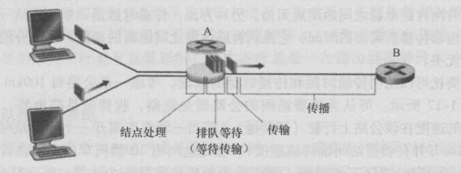

理想的情况那肯定是能够在两个端系统之间瞬间移动大量数据，并且没有任何数据丢失。
当然，这是不可能滴，双十一快递都还在路上被烧掉了呢。
所以说，计算机网络要限制在端系统之间的吞吐量(每秒能够传送的数据量)，并在端系统之间引入时延的概念。丢包这种情况也会发生的。

## 1：分组交换网中的时延概述
一个分组的历程：从一个源出发，通过一系列的路由器传输，在另一个源中结束它的所有历程。我们可以将路径上的源和路由器看做结点，则分组在每一个结点都会经历几种不同类型的时延。
具体的时延分类有以下：
  - 1：**结点处理时延**(nodal processing delay)
  - 2: **排队时延**(queuing delay)
  - 3: **传输时延**(transmission delay)
  - 4：**传播时延**(propagation delay)
  - 上述几种时延加起来，引入了第五个概念：**结点总时延**(total nodal delay)

下面来具体讨论一下时延的类型：

  

上图的情景描述为：图中是源到目的地之间的端到端路径的一部分，考虑的情况是一个分组从上游结点通过路由器A向路由器B发送。
理解图中标出的路由器A处的结点时延。
  - 路由器A具有通向路由器B的链路，通向该链路之前会有一个队列(缓存)
  - 当分组从上游结点到达路由器A的时候，首先会检查该分组的首部，目的是决定该分组应该去向哪一条链路。
  - 注意：仅仅在输出链路上没有其他分组传输并且没有其他分组排在该队列的前面时，才可以在该链路上传输要传输的分组。否则的话是要排队滴。

### 处理时延
做什么操作产生的处理时延？
  - 检查分组
  - 决定将该分组导向何处
  - 检查比特级别的差错，这些差错是从上游结点向路由器A传输分组的时候带来的。
上面的操作都会消耗时间，这些时间称为处理时延

分组处理之前和处理之后有什么用？
  - 处理之后，路由器将该分组引向通往路由器B链路之前的队列。
数量级？
  - 微秒或者更低
### 排队时延
什么情况下带来排队时延？
  - 队列中，当分组在链路上等待传输的时候
排队时延受什么影响呢？
  - 取决于先期到达的正在排队等待向链路传输的分组数量。就是队列中前面排队吃鸡蛋灌饼的人数。
  - 如果队列是空的，并且没有其他分组正在传输，则排队时延为0
  - 如果流量很大，并且其他分组在等待传输，则排队时延很长
(?????到达分组期待发现的分组数量是到达该队列的流量的强度和性质的函数)
  - 这什么狗翻译，我咋没读懂
数量级？
  - 毫秒到微秒
### 传输时延
### 传播时延
### 传输时延和传播时延的比较

## 2：排队时延和丢包
## 3：端到端时延
## 4：吞吐量
